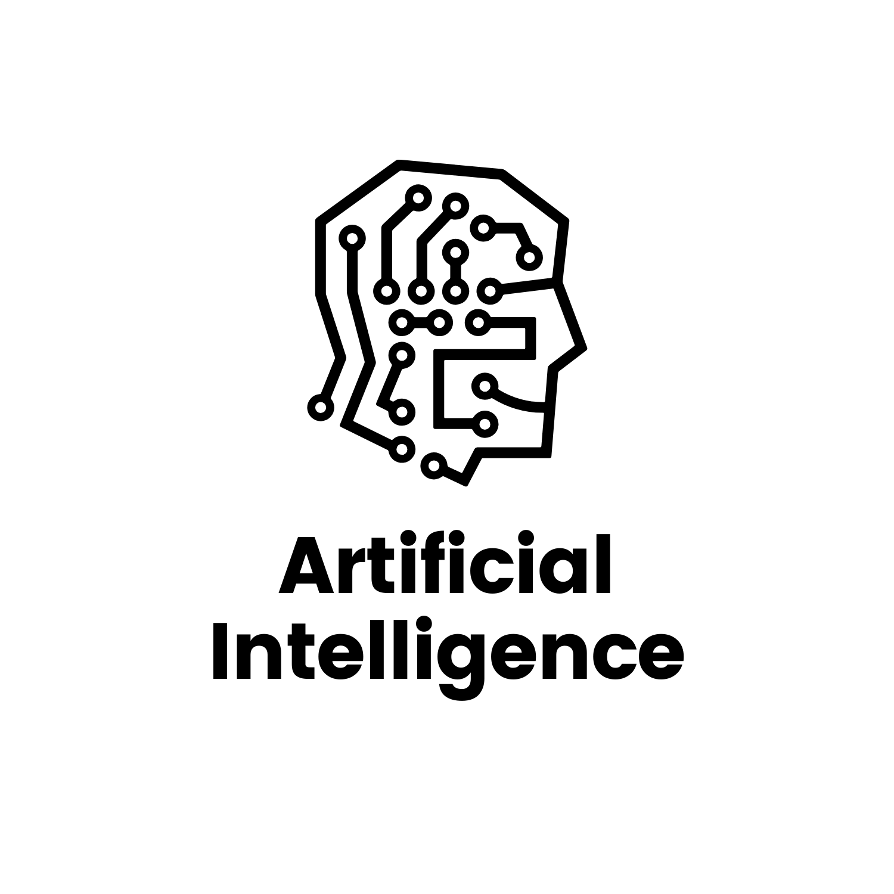
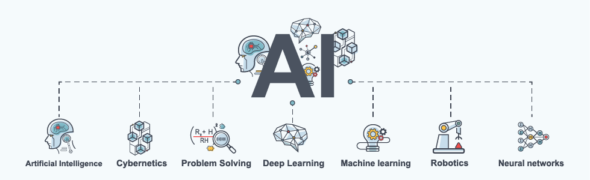

# কৃত্রিম বুদ্ধিমত্তা \(Artificial Intelligence\)

## **কৃত্রিম বুদ্ধিমত্তা কি?**

যুক্তি, সমস্যা সমাধান, মানুষের ভাষা বোঝার ক্ষমতা, উপলব্ধি, শিক্ষণ, পরিকল্পনা, কোনো বস্তুর অবস্থানের পরিবর্তন ঘটানো বা কোনো বিষয়ে হস্তক্ষেপ করার মতো সামর্থ্যসম্পন্ন মেশিনই হচ্ছে কৃত্রিম বুদ্ধিমত্তাসম্পন্ন মেশিন।

কৃত্রিম বুদ্ধিমত্তার জনক ব্রিটিশ বিজ্ঞানী ও গনিতবিদ আ্যলান টুরিং। তার পাশাপাশি জন ম্যাকার্থিও এআই এবং কম্পিউটার বিজ্ঞানে অনস্বীকার্য অবদান রেখেছেন। তিনি সর্বপ্রথম Artificial Intelligence নামক টার্মটি ব্যবহার করেন ১৯৫৫ সালে। এছাড়াও তার ক্লাউড কম্পিউটিংয়ে বেশ অবদান রয়েছে।

সুতরাং কৃত্রিম বুদ্ধিমত্তা কম্পিউটার বিজ্ঞানের এমন একটি ক্ষেত্র যেখানে মানুষের বুদ্ধিমত্তা ও চিন্তাশক্তিকে কৃত্রিম উপায়ে প্রযুক্তি নির্ভর যন্ত্রের মাধ্যমে বাস্তবায়ন করা হয়।

### কৃত্রিম বুদ্ধিমত্তার ইতিহাস -

কৃত্রিম বুদ্ধিমত্তার শুরুটা হয় বিখ্যাত দার্শনিক ও গণিতবিদ রামন লোল কর্তৃক ১৩০০ খ্রিস্টাব্দে যুক্তি প্রর্দশন যন্ত্র তৈরি করার মাধ্যমে। তার বেশ কয়েকবছর পর অর্থ্যাৎ ১৬২৩ এর কাছাকাছি সময় উইলহেলম স্কিকার্ড রামন লালের ক্যালকুলাস রেটিওসিনেটরের সাথে, গটফ্রিড লিবিনিজ গনিত মেশিনের ধারণাকে সম্প্রসারিত করেছিলেন সংখ্যার পরিবর্তে ধারনার উপর অপারেশন পরিচালনার উদ্দেশ্যে। এর পরপরই মানুষের মধ্যে এআই বেশ সাধারণ বিষয় হয়ে গিয়েছিলো। ১৯৫৬ সালে ডার্টমাউথ কলেজের একটি কর্মশালায় প্রথম এআই গবেষণার ক্ষেত্র প্রতিষ্টিত হয়।

#### কৃত্রিম বুদ্ধিমত্তা বা আর্টিফিশিয়াল ইন্টেলিজেন্সর কিছু নমুনা-

* ১৯৯৭ সালে ডিপ ব্লু যা আই বি এম এর তৈরী কৃত্তিম বুদ্ধিমত্তা, তা দাবা খেলায় খ্যাতিমান গ্যারি কাস্পরাভকে হারিয়ে দেয়। 
* ২০১০ সালে গুগলের আলফাগো গো খেলায় বিশ্ব চ্যাম্পিয়নকে ৫ বারের মধ্যে ৪ বার হারিয়ে দেয়।

### কৃত্রিম বুদ্ধিমত্তা কিভাবে শিখবো?

কম্পিউটার বিজ্ঞান ও প্রকৌশলবিদ্যার একটি শাখা হচ্ছে কৃত্রিম বুদ্ধিমত্তা আর কৃত্রিম বুদ্ধিমত্তার ব্যবহারের ক্ষেত্র হচ্ছে এক্সপার্ট সিস্টেম ও রোবটিকস। এক্সপার্ট সিস্টেম ও রোবটিকসে কৃত্তিম বুদ্ধিমত্তা প্রয়োগ করার জন্য বিভিন্ন ধরনের প্রোগ্রামিং ভাষা যেমন—LISP, CLISP, C/C++, JAVA ইত্যাদি ব্যবহার করা হয়।

এছাড়াও - 

* প্রোগ্রামিং লাঙ্গুয়েজেস \(Python, Java, C/C++, SQL, R, Scala, Perl\) 
* মেশিন লার্নিং ফ্রেমেওয়ার্কস \(TensorFlow, Theano, Caffe, PyTorch, Keras, MXNET\) 
* ক্লাউড প্লাটফর্মস \(AWS, Azure, GCP\) 
* ওয়ার্কফ্লো ম্যানেজমেন্ট সিস্টেম \(Airflow, Luigi, Pinball\) 
* বিগ ডাটা টুলস \(Spark, HBase, Kafka, HDFS, Hive, Hadoop, MapReduce, Pig\) 
* ন্যাচারাল ল্যাঙ্গুয়েজ প্রসেসিং টুলস \(spaCy, NLTK\)

#### কৃত্রিম বুদ্ধিমত্তার প্রকারভেদ -

* আর্টিফিশিয়াল ন্যারো ইন্টেলিজেন্স 
* আর্টিফিশিয়াল জেনারেল ইন্টেলিজেন্স 
* আর্টিফিশিয়াল সুপার ইন্টেলিজেন্স

### কৃত্রিম বুদ্ধিমত্তা পড়ে আমরা যেসব ক্যারিয়ার গড়তে পারবো -

* মেশিন লার্নিং ইঞ্জিনিয়ার 
* রোবটিক্স ইঞ্জিনিয়ার 
* কম্পিউটার ভিশন ইঞ্জিনিয়ার 
* ডেটা সায়েন্টিস্ট 
* রিসার্চ সায়েন্টিস্ট 
* বিজনেস ইন্টেলিজেন্স ডেভেলপার 
* বিগ ডাটা ইঞ্জিনিয়ার/আর্চিটেক্ট

### কৃত্রিম বুদ্ধিমত্তা / এআই প্রকৌশলী হতে যেসব দক্ষতা প্রয়োজন -

    **১.গেটিং এ ডিগ্রী \(Getting a Degree\)** 

    **২.বিল্ডিং টেকনিকাল কম্পেটেন্সিস \(Building technical competencies\)**

* প্রোগ্রামিং ল্যাংগুয়েজ 
* স্ট্যাটিসটিকাল নলেজ
* অ্যাপ্লায়েড ম্যাথ ইন মেশিন লার্নিং 
* ন্যাচারাল ল্যাঙ্গুয়েজ প্রসেসিং
* ডিপ লার্নিং & নিউরাল নেটওয়ার্কস
* স্পার্ক
* বিগ ডাটা টেকনোলজিস

  **৩.নেসেসারি বিসনেস স্কিলস \(Necessary Business skills\)**

* ইনোভেটিভ রিসনিং
* প্রব্লেম-সলভিং স্কিলস
* এবিলিটি তো ওয়ার্ক ইন আ টীম

একজন এআই প্রকৌশলীর এনভিডিয়া, গুগল, অ্যাকসেন্টার আমাজন, উবার এবং ফেসবুক এর মতো কোম্পানীতে কাজ করার মতো সুযোগ রয়েছে।

### বিশ্বে এবং বাংলাদেশে কৃত্রিম বুদ্ধিমত্তার চাহিদা কেমন? ভবিষ্যৎ?

একুশ শতকের এই যুগে কৃত্রিম বুদ্ধিমত্তা ও রোবটিক্স প্রযুক্তির সুফল হিসেবে একেকটি রোবট জ্ঞানে, গুণে ও বুদ্ধিদীপ্ত আচরণে মানুষের সমকক্ষ হয়ে উঠছে। ওয়ার্ল্ড ইকোনমিক ফোরাম তাদের এক বৈশ্বিক আলোচনাসভায় জানিয়েছে, রোবটের অত্যধিক ব্যবহারের কারণে ২০২৫ সালের মধ্যে মাত্র চার বছরের ব্যবধানে বিশ্ব জুড়ে চাকরি হারাবে প্রায় সাড়ে ৭ কোটি কর্মজীবী মানুষ। অক্সফোর্ড বিশ্ববিদ্যালয়ের একদল বিজ্ঞানীর ভাষ্যমতে, আগামী ৫০ বছরের ব্যবধানে মানুষের অর্ধেক কাজ এবং ১২০ বছরের মধ্যে মানুষের সব কাজ সম্পন্ন হতে পারবে কৃত্রিম বুদ্ধিমত্তাসম্পন্ন অত্যাধুনিক রোবটের মাধ্যমে।

হ্যাপি লার্নিং🌸

