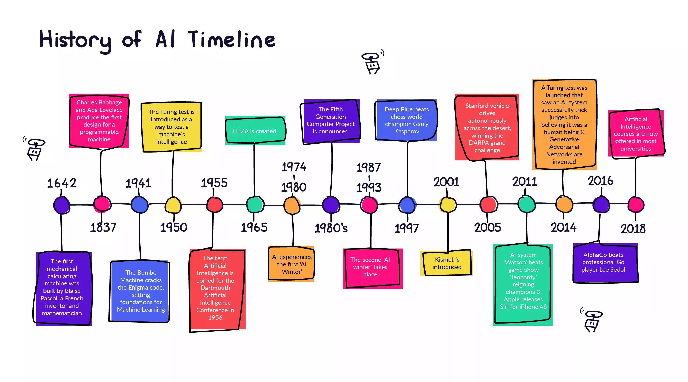

# কৃত্রিম বুদ্ধিমত্তার ইতিহাস

কৃত্রিম বুদ্ধিমত্তার শুরুটা হয় বিখ্যাত দার্শনিক ও গণিতবিদ রামন লোল কর্তৃক ১৩০০ খ্রিস্টাব্দে যুক্তি প্রর্দশন যন্ত্র তৈরি করার মাধ্যমে। তার বেশ কয়েকবছর পর অর্থ্যাৎ ১৬২৩ এর কাছাকাছি সময় উইলহেলম স্কিকার্ড রামন লালের ক্যালকুলাস রেটিওসিনেটরের সাথে, গটফ্রিড লিবিনিজ গনিত মেশিনের ধারণাকে সম্প্রসারিত করেছিলেন সংখ্যার পরিবর্তে ধারনার উপর অপারেশন পরিচালনার উদ্দেশ্যে। এর পরপরই মানুষের মধ্যে এআই বেশ সাধারণ বিষয় হয়ে গিয়েছিলো। ১৯৫৬ সালে ডার্টমাউথ কলেজের একটি কর্মশালায় প্রথম এআই গবেষণার ক্ষেত্র প্রতিষ্টিত হয়।

