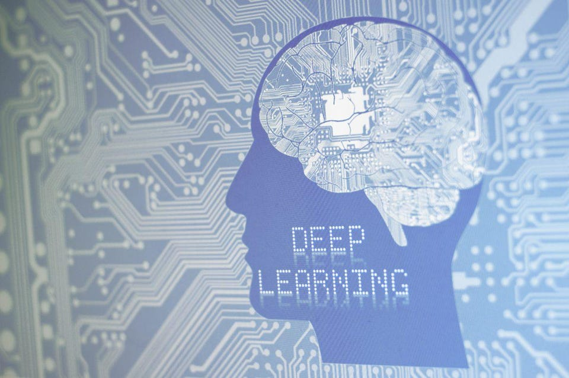
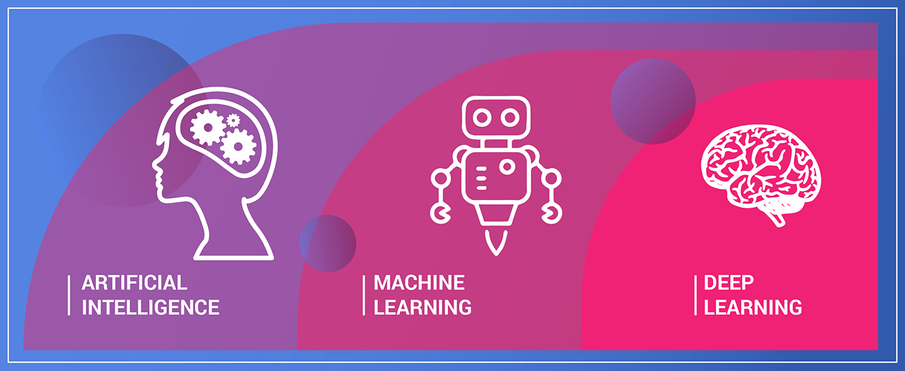

# ডিপ লার্নিং \(Deep Learning\)

## ডিপ লার্নিং কি?

“ডিপ লার্নিং” , ডিপ স্ট্রাকচারড লার্নিং, হায়ারারকিকাল লার্নিং বা ডিপ মেশিন লার্নিং নামেও পরিচিত। ডিপ লার্নিং হচ্ছে মেশিন লার্নিং এর একটি সাবফিল্ড যেখানে মেশিন লার্নিং এর জন্য নিউরাল নেটওয়ার্ক ব্যবহার করা হয়। ডিপ লার্নিং টেকনিক আর্টিফিশিয়াল নিউরাল নেটওয়ার্ক তৈরির মাধ্যমে কাজ করে থাকে। মূলত নিউরাল নেটওয়ার্কই হচ্ছে ডিপ লার্নিং এর বেইস।



### ডিপ লার্নিং এর ইতিহাস?

পোস্টাল সার্ভিসে খামের উপর বিভিন্ন ধরনের হাতের লেখা চিহ্নিত করতে ডিপ লার্নিং ব্যবহার করা হয়। ১৯৯০ সালের দিক থেকে ডিপ লার্নিং এর এই প্রয়োগ চলে আসছে। এরপর ২০০৪ থেকে ২০০৫ সালের দিকে ডিপ লার্নিং এর ব্যবহার খুব উল্লেখযোগ্য ভাবে বেড়ে চলেছে।

মূলত তিনটি কারণে — 

প্রথমত, ইদানিং কালের ডিপ লার্নিং মেথড গুলো যা মানুষের চেয়ে অনেক বেশি ভালো ভাবে অবজেক্ট রিকগনিশনের বা ক্লাসিফিকেশনের কাজ করতে পেরেছে।

দ্বিতীয়ত, GPU এর কল্যাণে অনেক বড় আকারের ডিপ নেটওয়ার্ক খুব কম সময়ের মধ্যেই লার্নিং শেষ করে নিতে পেরেছে।

এবং তৃতীয়ত, খুব ইফেক্টিভ লার্নিং এর জন্য যে পরিমাণ ডাটার প্রয়োজন পরে সেই লেভেলের ডাটা গত ৫/৬ বছরে ব্যবহার উপযোগীভাবে তৈরি হচ্ছে বিভিন্ন সার্ভিসের মাধ্যমে। তাছাড়া, ২০০৬ সালে জিওফ্রে হিন্টন একটা পেপারে দেখিয়েছিলেন কিভাবে একটা ডিপ নিউরাল নেটওয়ার্ককে ঠিকমতো ট্রেইন করলে সেটার অ্যাক্যুরেসি আসে ৯৮% এর বেশি। ব্যাপারটা ছিলো হাতের লেখা ডিজিট মেশিন নির্ভুলভাবে পড়তে পারে কিনা। এই টেকনিকটাকে ব্র্যান্ডিং করা হয়েছিলো 'ডিপ লার্নিং' হিসেবে।

### ডিপ লার্নিং এর অ্যাপ্লিকেশনসমূহ - 

1. ছবি থেকে বিভিন্ন অবজেক্ট চিহ্নিতকরন এবং ক্লাসিফিকেশন তৈরি করা। 
2. সাদা ও কালো ছবির Colorization। 
3. ছবিতে ক্যাপশন জেনারেশন এবং চিহ্নিতকরন । 
4. স্বয়ংক্রিয় হস্তাক্ষর জেনারেশন এবং চিহ্নিতকরন । 
5. ক্যারেক্টার টেক্সট জেনারেশন এবং চিহ্নিতকরন । 
6. নির্বাক চলচ্চিত্রের সাউন্ড যোগ করার পদ্ধতি । 
7. শব্দ থেকে টেক্সট জেনারেশন । 
8. স্বয়ংক্রিয় মেশিন ট্রান্সলেসন। 
9. স্বয়ংক্রিয় গেম খেলা । 
10. বিগ ডাটা এনালাইসিস এবং আরও অন্যান্য চমকপ্রদ কিছু অ্যাপ্লিকেশন আছে ।

### ডিপ লার্নিং এর অন্যতম কিছু লাইব্রেরী - 

1. caffe 
2. Theano 
3. TensorFlow 
4. Lasagne 
5. Keras 
6. mxnet

### ডিপ লার্নিং ইঞ্জিনিয়াররা যেসব কাজগুলি সম্পাদন করে? 

ডিপ লার্নিং ইঞ্জিনিয়াররা ডেটা ইঞ্জিনিয়ারিং, মডেলিং এবং স্থাপনার কাজগুলো করে।

1. ডেটা ইঞ্জিনিয়ারিং সাবটাস্ক যেমন ডেটার প্রয়োজনীয়তা নির্ধারণ, সংগ্রহ, লেবেলিং, পরিদর্শন, পরিষ্কার করা, বাড়ানো এবং ডেটা সরানো।
2. মডেলিং সাবটাস্ক যেমন ডিপ লার্নিং মডেল প্রশিক্ষণ, মূল্যায়ন মেট্রিক্স সংজ্ঞায়িত করা, হাইপারপ্যারামিটার অনুসন্ধান করা এবং গবেষণা পত্র পড়া।
3. প্রোটোটাইপ কোডকে প্রোডাকশন কোডে রূপান্তর করা, মডেল স্থাপনের জন্য ক্লাউড এনভায়রনমেন্ট তৈরি করা, বা সাড়া দেওয়ার সময় উন্নত করা এবং ব্যান্ডউইথ সংরক্ষণের মতো স্থাপনার সাবটাস্ক।

### ডিপ লার্নিং ইঞ্জিনিয়ার হতে যেসব দক্ষতা প্রয়োজন - 

ডিপ লার্নিং ইঞ্জিনিয়াররা কঠিন বৈজ্ঞানিক এবং প্রকৌশল দক্ষতা প্রদর্শন করে - 

1. ডাটা সাইন্স 
2. বিসনেস আকামেন 
3. কমিউনিকেশন 
4. সফটওয়্যার ইঞ্জিনিয়ারিং 
5. এলগোরিদম কোডিং 
6. মেশিন লার্নিং 
7. ম্যাথমেটিক্স ইত্যাদি।

### ডিপ লার্নিং ইন্জিনিয়ার যেসব টুল ব্যবহার করে?

১.মডেলিং প্রাথমিকভাবে পাইথনে প্যাকেজ যেমন numpy, scikit-learn, pandas, matplotlib, TensorFlow, এবং PyTorch ব্যবহার করে করা হয়। ডেটা ইঞ্জিনিয়ারিং পাইথন এবং/অথবা এসকিউএল বা অন্যান্য ডোমেইন-নির্দিষ্ট ক্যোয়ারী ভাষায় ঘটে।

২.অবজেক্ট-ওরিয়েন্টেড প্রোগ্রামিং ল্যাঙ্গুয়েজ \(যেমন পাইথন, এবং জাভা, সি ++,\) এবং AWS, GCP এবং Azure এর মতো ক্লাউড প্রযুক্তি ব্যবহার করে ডিপ্লয়মেন্ট প্রয়োগ করা হয়।

৩.সহযোগিতা এবং কর্মপ্রবাহ পরিচালিত হয় একটি সংস্করণ নিয়ন্ত্রণ ব্যবস্থা \(উদাহরণস্বরূপ, গিট, সাবভারশন এবং মারকিউরিয়াল\), ইউনিক্সের মতো একটি কমান্ড লাইন ইন্টারফেস \(CLI\), ইন্টিগ্রেটেড ডেভেলপমেন্ট এনভায়রনমেন্ট \(IDE\) যেমন Jupyter Notebook, এবং Sublime, এবং একটি সমস্যা জিরার মতো ট্র্যাকিং পণ্য।

### ডিপ লার্নিং এর প্রয়োগ - 

ডিপ লার্নিং প্রযুক্তি নিয়ে কাজ করছে এমন অনেক কোম্পানীর মধ্যে ইউটিউব এবং মাইক্রোসফট অন্যতম। ইউটিউব থেকে প্রায় ১০ মিলিয়ন ছবি বাছাই করে প্রদর্শন করে,যেসব ছবিতে সুনির্দিষ্ট কোনো বস্তুর অবস্থান রয়েছে। তাছাড়া মাইক্রোসফট ডিপ লার্নিং ব্যবহার করে রিয়েল টাইমে ভাষান্তরের সফটওয়্যার তৈরি করেছে।

ডিপ লার্নিং এর অনেক গুরুত্বপূর্ণ এবং সাকসেসফুল অ্যাপ্লিকেশন আছে যেগুলো আর্টিফিশিয়াল ইন্টেলিজেন্সকে দিয়েছে নতুন মাত্রা। 

ডিপ লার্নিং এর কিছু উল্লেখযোগ্য প্রয়োগ হচ্ছে - 

1. নেচারাল ল্যাঙ্গুয়েজ প্রসেসিং 
2. সেলফ ড্রাইভিং কার
3. অবজেক্ট ডিটেকশন 
4. ভার্চূয়াল অ্যাসিসটেন্ট যেমন গুগোল অ্যাসিস্ট্যান্ট, সিরি 
5. কালারিং ব্ল্যাক এন্ড হোআইট ইমেজ ইত্যাদি ।

### ডিপ লার্নিং কিভাবে ব্যবহৃত হচ্ছে - 

বর্তমানে প্রায় সব শিল্পে অটোমোবাইল, এরিয়া মহাকাশ এবং অটোমেশন থেকে চিকিৎসা শুরু হচ্ছে।

1. গুগল তার ভয়েস এবং ইমেজ শনাক্তকরণ আলগোরিদম হিসেবে ডিপ লার্নিং ব্যবহার করে। Netflix এবং অ্যামাজন আপনি কি দেখতে বা পরবর্তী কিনতে চান সেটা ডিপ লার্নিং ব্যবহার করে, করে থাকে। 
2. গবেষকরা ডিপ আইডেন্টিফিকেশন নেটওয়ার্ক ব্যবহার করে স্বয়ংক্রিয়ভাবে যেমন স্টপ লক্ষণ এবং ট্র্যাফিক লাইট বস্তু সনাক্ত করতে ব্যবহার করা হয়। 
3. উপগ্রহগুলির বস্তুগুলি সনাক্ত করার জন্য ডিফল্ট লার্নিং ব্যবহার করা হয় যা আগ্রহের ক্ষেত্রগুলি সনাক্ত করে, এবং সৈন্যদের জন্য নিরাপদ বা অনিরাপদ অঞ্চলগুলি চিহ্নিত করে।
4. ফেসবুক স্বয়ংক্রিয়ভাবে আপনার ছবিতে বন্ধুদের পায় এবং ট্যাগ করে। স্কাইপ রিয়েল টাইমে এবং বেশ সঠিকভাবেও যোগাযোগ করতে পারে। 
5. চিকিৎসা গবেষকরা স্বয়ংক্রিয়ভাবে ক্যান্সার কোষগুলি সনাক্ত করতে ডিপ লার্নিং ব্যবহার করেন। 
6. স্বয়ংক্রিয় শ্রবণ ও বক্তৃতা অনুবাদেও ডিপ লার্নিং ব্যবহার করা হচ্ছে।

### ডিপ লার্নিং এর মাধ্যমে যেসব ক্যারিয়ার গড়ার সুযোগ রয়েছে - 

যেহেতু মেশিন লার্নিং এর সাবফ্লিড ডিপলার্নিং। এআই, নিউরাল নেটওয়ার্কও ডিপলার্নিং এর সাথে কানেক্ট সেহেতু মেশিন লার্নিং, এআই, নিউরাল নেটওয়ার্ক রিলেটেড ক্যারিয়ারগুলো গ্রহন করার সুযোগ রয়েছে আমাদের। 

এছাড়াও- 

1. ডেটা সায়েন্টিস্ট 
2. মেশিন লার্নিং ইঞ্জিনিয়ার 
3. এআই ইঞ্জিনিয়ার 
4. ডিপ লার্নিং ইঞ্জিনিয়ার ইত্যাদি ক্যারিয়ার হিসেবে নেওয়া যাবে।

হ্যাপি লার্নিং♥️🌸

