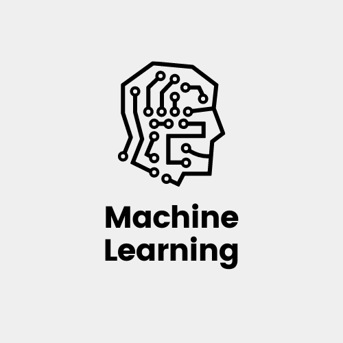

# মেশিন লার্নিং কি?

মেশিন লার্নিং কম্পিউটার বিজ্ঞানের এমন একটি ক্ষেত্র যা কম্পিউটারকে শুধু স্পষ্টভাবে প্রোগ্রাম করার, শেখার ক্ষমতাই দেয় না সাথে সাথে সেটা সমস্যার সমাধান করতে সাহায্য করে।

সুতরাং, যখন কোন একটা সমস্যার সমাধানের জন্য প্রোগ্রামিংয়ের মাধ্যমে এমন একটা অ্যালগরিদম ইমপ্লিমেন্ট করানো হয় যাতে কম্পিউটার নিজেই পরিবেশ এবং পূর্বের ঘটনা থেকে শিখতে পারে তখন সেটাই হচ্ছে মেশিন লার্নিং।

মেশিন লার্নিং শব্দটা প্রথম ব্যবহার করেন আর্থার স্যামুয়েল ১৯৫৯ সালে। বিল গেটসের একটা বিখ্যাত উক্তি রয়েছে মেশিন লার্নিং নিয়ে- A breakthrough in machine learning would be worth ten Microsoft.

